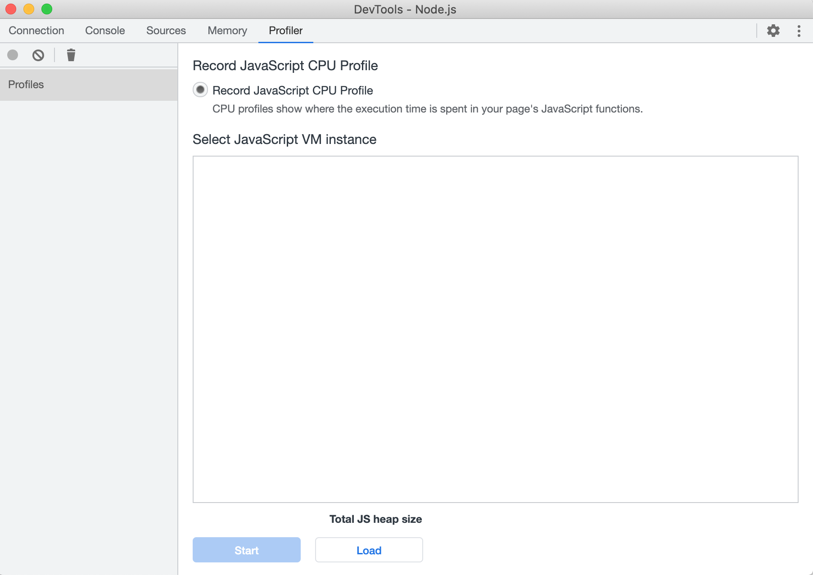

# middy-profiler

Middy middleware for profiling CPU on AWS Lambda.
Captured CPU profiling data is put into specified AWS S3 bucket with the following object/file name format:
```
${functionName}/${awsRequestId}/${fileName}.cpuprofile
```
By default, file name (`${fileName}`) is `cpu_profile` but you can configure it as explained below.

Then, you can download the CPU profiling file from AWS S3 and open with any CPU profiler tool like **Chrome DevTools**:

- Go to **Inspector** in **Chrome DevTools** by browsing to `chrome://inspect/`:


- Click `Open dedicated DevTools for Node` to go to the `Node.js DevTools` page:


- Go to `Profiler` tab, click the `Load` button and select the downloaded CPU profiling file to load:



- Then select the `Chart` to see the CPU profiling as flame graph:


 
## Installation

To install the middleware, you can use NPM:

```
npm install --save middy-profiler
```

**Note:** Requires `@middy/core` version `2.0.0`+


## Usage

* Register `middy-profiler` middleware in your handler:
```javascript
const middy = require('@middy/core');
const profiler = require('middy-profiler');

const handler = async(event, context) => {
  // Do something meaningful

  return {
    statusCode: 200,
  }
}

module.exports.handler = middy(handler).use(profiler());
```

* Configure AWS S3 bucket name to put the CPU profiling data 
by *environment variable* or *options* passed to middleware. 

  **Note 1:** Your AWS Lambda function must have enough permission (`PutObject`) for writing to the specified target AWS S3 bucket. 

  **Note 2:** This configuration is **mandatory** and if it is not specified, profiling will be disabled.

  - **By environment variable:**
  Set `MIDDY_PROFILER_S3_BUCKET_NAME` environment variable with the target bucket name.
  ```
  MIDDY_PROFILER_S3_BUCKET_NAME=my-profiling-bucket
  ```  

  - **By options:**
  Pass the bucket name through options.
  ```javascript
  const profiler = require('middy-profiler');

  module.exports.handler = 
      middy(handler).
          use(profiler({
              s3: { 
                  bucketName: 'my-profiling-bucket'
              }
          })
      );
  ```

* **Optionally**, you can configure CPU sampling interval in milliseconds. 
Please note that a high (for ex. `100`, `500`, `1000`) sampling interval may result in an extremely high level of profiling output (not enough detail) being captured.
By default, sampling interval is `10` milliseconds and 
it can be configured by *environment variable* or *options* passed to middleware:

  - **By environment variable:**
  Set `MIDDY_PROFILER_SAMPLING_INTERVAL` environment variable with the desired sampling interval.
  ```
  MIDDY_PROFILER_SAMPLING_INTERVAL=50
  ```  

  - **By options:**
  Pass the timeout margin through options.
  ```javascript
  const profiler = require('middy-profiler');

  module.exports.handler = 
      middy(handler).
          use(profiler({
              samplingInterval: 50
          })
      );
  ```
  
* **Optionally**, you can configure name of the profiling data file which is put into target AWS S3 bucket.
It's value is `cpu_profile` by default but can be configured by *environment variable* or *options* passed to middleware:

  - **By environment variable:**
  Set `MIDDY_PROFILER_S3_FILE_NAME` environment variable with the name of the file.
  ```
  MIDDY_PROFILER_S3_FILE_NAME=lambda_invocation_cpu_profile
  ```  

  - **By options:**
  Pass the file bame through options.
  ```javascript
  const profiler = require('middy-profiler');

  module.exports.handler = 
      middy(handler).
          use(profiler({
              s3: { 
                  fileName: 'lambda_invocation_cpu_profile'
              }
          })
      );
  ```


## Contributing

Everyone is very welcome to contribute to this repository. 
Feel free to [raise issues](https://github.com/serkan-ozal/middy-profiler/issues) 
or to [submit Pull Requests](https://github.com/serkan-ozal/middy-profiler/pulls).


## License

Licensed under [MIT License](LICENSE).
