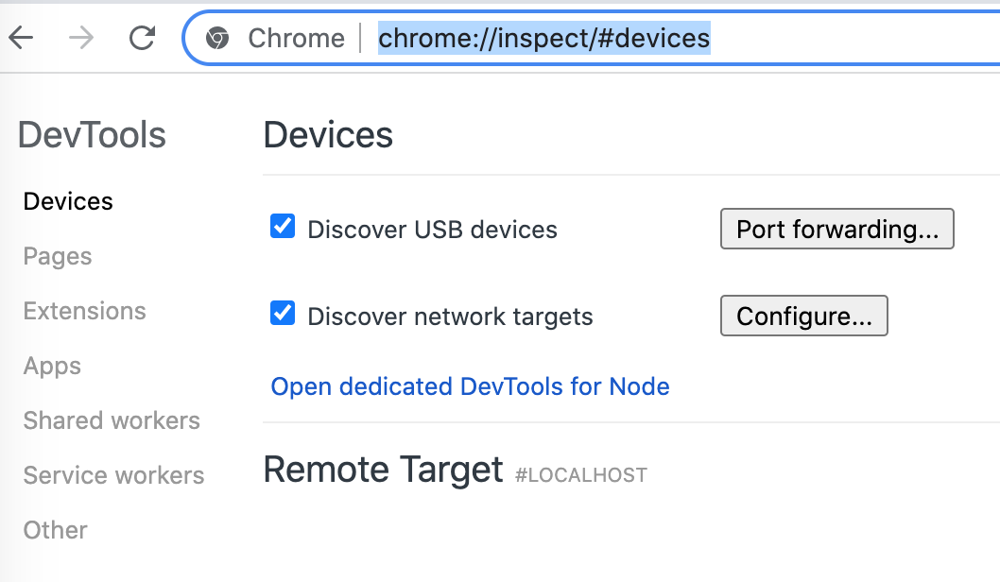
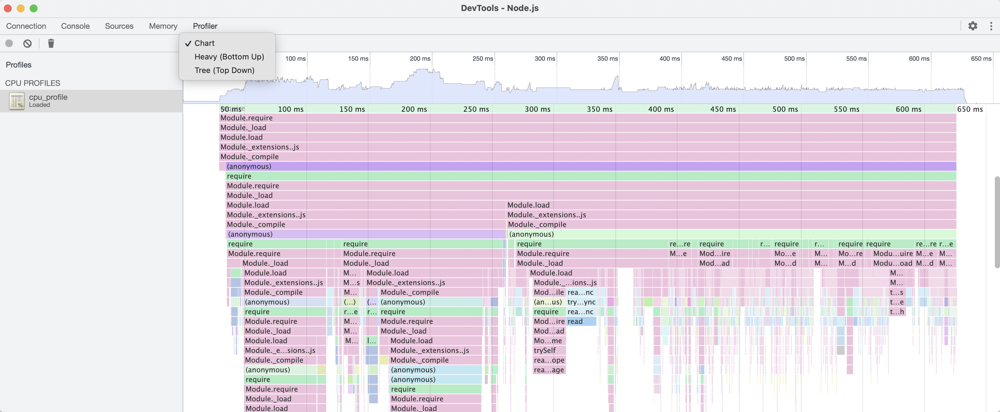

# middy-profiler


Middy middleware for profiling CPU on AWS Lambda.
Captured CPU profiling data is put into specified AWS S3 bucket with the following object/file name format:
```
${functionName}/${awsRequestId}/${fileName}.cpuprofile
```
By default, file name (`${fileName}`) is `cpu_profile` but you can configure it as explained below.

Then, you can download the CPU profiling file from AWS S3 and open with any CPU profiler tool like **Chrome DevTools**:

- Go to **Inspector** in **Chrome DevTools** by browsing to `chrome://inspect/`:



- Click `Open dedicated DevTools for Node` to go to the `Node.js DevTools` page:


- Go to `Profiler` tab, click the `Load` button and select the downloaded CPU profiling file to load:


- Then select the `Chart` to see the CPU profiling as flame graph:


 
## Installation

You can add `middy-profiler` package into your AWS Lambda function either by NPM package or by AWS Lambda layer as shown below:

### By NPM package

To install the middleware, you can use NPM:

```
npm install --save middy-profiler
```

### By AWS Lambda Layer

You can also add `middy-profiler` as layer into your AWS Lambda function.

```
arn:aws:lambda:${region}:273094347961:layer:middy-profiler:${layer-version}

```

**Latest layer version:** 

**Note:** In the ARN above, you need to replace `${region}` with the actual AWS region you deployed your AWS Lambda function. 

### Notes on installation

- The `middy-profiler` requires `@middy/core` version `2.0.0`+. 

- There is also **standalone** mode to be able to use `middy-profiler` without `middy` framework. You can check [Standalone Usage (without Middy)](#standalone-usage-without-middy) section for the details.


## Usage

* Register `middy-profiler` middleware in your handler:
```javascript
const middy = require('@middy/core');
const profiler = require('middy-profiler');

const handler = async(event, context) => {
  // Do something meaningful

  return {
    statusCode: 200,
  }
}

module.exports.handler = middy(handler).use(profiler());
```

* Configure AWS S3 bucket name to put the CPU profiling data 
by *environment variable* or *options* passed to middleware. 

  **Note 1:** Your AWS Lambda function must have enough permission (`PutObject`) for writing to the specified target AWS S3 bucket. 

  **Note 2:** This configuration is **mandatory** and if it is not specified, profiling will be disabled.

  - **By environment variable:**
  Set `MIDDY_PROFILER_S3_BUCKET_NAME` environment variable with the target bucket name.
  ```
  MIDDY_PROFILER_S3_BUCKET_NAME=my-profiling-bucket
  ```  

  - **By options:**
  Pass the bucket name through options.
  ```javascript
  const profiler = require('middy-profiler');

  module.exports.handler = 
      middy(handler).
          use(profiler({
              s3: { 
                  bucketName: 'my-profiling-bucket'
              }
          })
      );
  ```
  
* **Optionally**, if you want to profile since the init phase at coldstart (by default profiler is activated by the start of request which doesn't include initialization phase such as main handler import/require, client/SDK creation, etc ...), you need to activate profiler during bootstrap:

  - **By environment variable:**
  Set (or append to existing one) `NODE_OPTIONS` environment variable with the bootstrap options to initialize profiler at startup.
  ```
  NODE_OPTIONS=-r middy-profiler/src/bootstrap
  ```  

* **Optionally**, you can configure CPU sampling interval in milliseconds. 
Please note that a high (for ex. `100`, `500`, `1000`) sampling interval may result in an extremely high level of profiling output (not enough detail) being captured.
By default, sampling interval is `10` milliseconds and 
it can be configured by *environment variable* or *options* passed to middleware:

  - **By environment variable:**
  Set `MIDDY_PROFILER_SAMPLING_INTERVAL` environment variable with the desired sampling interval.
  ```
  MIDDY_PROFILER_SAMPLING_INTERVAL=50
  ```  

  - **By options:**
  Pass the sampling interval through options.
  ```javascript
  const profiler = require('middy-profiler');

  module.exports.handler = 
      middy(handler).
          use(profiler({
              samplingInterval: 50
          })
      );
  ```
  
* **Optionally**, you can configure name of the profiling data file which is put into target AWS S3 bucket.
It's value is `cpu_profile` by default but can be configured by *environment variable* or *options* passed to middleware:

  - **By environment variable:**
  Set `MIDDY_PROFILER_S3_FILE_NAME` environment variable with the name of the file.
  ```
  MIDDY_PROFILER_S3_FILE_NAME=lambda_invocation_cpu_profile
  ```  

  - **By options:**
  Pass the file name through options.
  ```javascript
  const profiler = require('middy-profiler');

  module.exports.handler = 
      middy(handler).
          use(profiler({
              s3: { 
                  fileName: 'lambda_invocation_cpu_profile'
              }
          })
      );
  ```
  
* **Optionally**, you can configure timeout margin (in **milliseconds**) which is the minimum remaining time 
before the actual timeout happens to assume that invocation will timeout. 
So we take action, finish the profiler and report the collected profiling data because when the timeout happens, 
the game is over and there is nothing to do.
By default, timeout margin is `1000` milliseconds and 
it can be configured by *environment variable* or *options* passed to middleware:

  - **By environment variable:**
  Set `MIDDY_PROFILER_TIMEOUT_MARGIN` environment variable with the desired value for the timeout margin.
  ```
  MIDDY_PROFILER_TIMEOUT_MARGIN=500
  ```  

  - **By options:**
  Pass the timeout margin through options.
  ```javascript
  const profiler = require('middy-profiler');

  module.exports.handler = 
      middy(handler).
          use(profiler({
              timeoutMargin: 500
          })
      );
  ```

* **Optionally**, you can configure start delay (in **milliseconds**) to start the profiler after specified amount of time 
(for ex. conditionally start profiler if invocation took longer than expected).
It can be configured by *environment variable* or *options* passed to middleware:

  - **By environment variable:**
  Set `MIDDY_PROFILER_START_DELAY` environment variable with the desired value for the profiler start delay.
  ```
  MIDDY_PROFILER_START_DELAY=5000
  ```  

  - **By options:**
  Pass the start delay through options.
  ```javascript
  const profiler = require('middy-profiler');

  module.exports.handler = 
      middy(handler).
          use(profiler({
              startDelay: 5000
          })
      );
  ```
  
* **Optionally**, you can configure invocation duration threshold (in **milliseconds**) to be able to report profiling data 
conditionally if the invocation duration is higher than the specified threshold.
It can be configured by *environment variable* or *options* passed to middleware:

  - **By environment variable:**
  Set `MIDDY_PROFILER_REPORT_DURATION_THRESHOLD` environment variable with the desired value for the invocation duration threshold to report profiling data conditionally.
  ```
  MIDDY_PROFILER_REPORT_DURATION_THRESHOLD=10000
  ```  

  - **By options:**
  Pass the report duration threshold through options.
  ```javascript
  const profiler = require('middy-profiler');

  module.exports.handler = 
      middy(handler).
          use(profiler({
              report: {
                  durationThreshold: 10000
              }    
          })
      );
  ```
  
* **Optionally**, you can disable/enable profiler without changing code even though it is registered to `middy` or self activated on bootstrap.

  - **By environment variable:**
  Set `MIDDY_PROFILER_ENABLE` environment variable to `false` to disable profiler or to `true` (which is default) to enable profiler back.
  ```
  MIDDY_PROFILER_ENABLE=false
  ```  

## Standalone Usage (without Middy)

If you want to use `middy-profiler` standalone without `middy`, you need to activate standalone mode during bootstrap through environment variable without any code change. For activation, you need to set (or append to existing one) `NODE_OPTIONS` environment variable with the standalone mode bootstrap options to initialize profiler at startup:
  ```
  NODE_OPTIONS=-r middy-profiler/src/standalone
  ```  
  
To configure profiler in the standalone mode, you can use **environment variables** mentioned in the [Usage](#usage) section above.  

## Use Cases

- [Vincent Voyer](https://twitter.com/vvoyer) discovered significant performance impact of enabling source maps with the help of this profiler. You can find more info here: https://twitter.com/vvoyer/status/1498436054851981320


## Contributing

Everyone is very welcome to contribute to this repository. 
Feel free to [raise issues](https://github.com/serkan-ozal/middy-profiler/issues) 
or to [submit Pull Requests](https://github.com/serkan-ozal/middy-profiler/pulls).


## License

Licensed under [MIT License](LICENSE).
